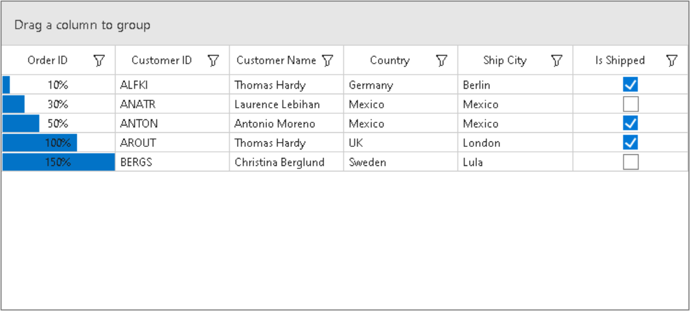

# How to customize the ProgressBarColumn text in WinForms DataGrid?

This sample illustrates how to customize the ProgressBarColumn text in [WinForms DataGrid](https://www.syncfusion.com/winforms-ui-controls/datagrid) (SfDataGrid).

By default, the DataGrid [GridProgressBarColumn](https://help.syncfusion.com/cr/windowsforms/Syncfusion.WinForms.DataGrid.GridProgressBarColumn.html) have maximum value as 100, you can change the this by overriding the OnRender method in [GridProgressBarColumnCellRenderer](https://help.syncfusion.com/cr/windowsforms/Syncfusion.Windows.Forms.Grid.GridProgressBarCellRenderer.html) class.

```c#
this.sfDataGrid.CellRenderers.Remove("ProgressBar");
this.sfDataGrid.CellRenderers.Add("ProgressBar", new GridProgressBarColumnExt(new ProgressBarAdv()));

public class GridProgressBarColumnExt : GridProgressBarCellRenderer
{
    ProgressBarAdv ProgressBar;

    public GridProgressBarColumnExt(ProgressBarAdv progressBar) : base(progressBar)
    {
        ProgressBar = progressBar;
    }

    protected override void OnRender(Graphics paint, Rectangle cellRect, string cellValue, CellStyleInfo style, DataColumnBase column, RowColumnIndex rowColumnIndex)
    {
        ProgressBar.CustomText = cellValue + "%";
        ProgressBar.TextStyle = ProgressBarTextStyles.Custom;
        decimal decimalvalue = decimal.Parse(cellValue);
        var intvalue = decimal.ToInt32(decimalvalue);
        cellValue = intvalue.ToString();
        base.OnRender(paint, cellRect, cellValue, style, column, rowColumnIndex);
    }
}

```



## Requirements to run the demo
 Visual Studio 2015 and above versions